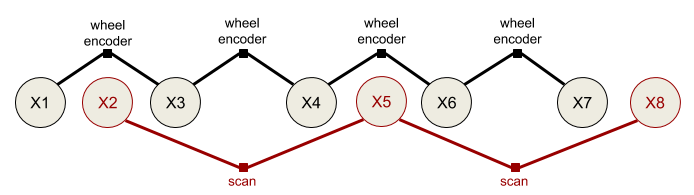
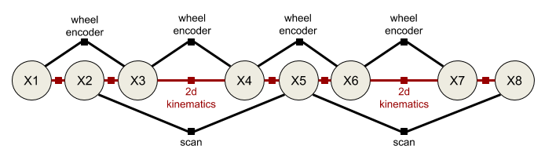

# fuse
The fuse stack provides a general architecture for performing sensor fusion live on a robot. Some possible applications
include state estimation, localization, mapping, and calibration.

## Overview
fuse is a ROS framework for performing sensor fusion using nonlinear least squares optimization techniques. In
particular, fuse provides:
* a plugin-based system for modeling sensor measurements
* a similar plugin-based system for motion models
* a plugin-based system for publishing optimized state values
* an extensible state variable definition
* a "contract" on how an optimizer will interact with the above components
* and some common implementations to get everyone stated
(unpresented) ROSCon 2018 Lightning Talk [slides](docs/fuse_lightning_talk.pdf)

Data flows through the system approximately like this:
* A sensor model receives raw sensor data. The sensor model generates a constraint and sends it to the optimizer.
* The optimizer receives the new sensor constraint. A request is sent to each configured motion model to generate
  a constraint between the previous state and the new state involved in the sensor constraint.
* The motion model receives the request and generates the required constraints to connect the new state to the
  previously generated motion model chain. The motion model constraints are sent to the optimizer.
* The optimizer adds the new sensor model and motion model constraints and variables to the graph and
  computes the optimal values for each state variable.
* The optimal state values are sent to each configured publisher (as well as the sensor models and motion models).
* The publishers receive the optimized state values and publish any derived quantities on ROS topics.
* Repeat

It is important to note that much of this flow happens asynchronously in practice. Sensors are expected to operate
independently from each other, so each sensor will be sending constraints to the optimizer at its own frequency. The
optimizer will (probably) cache the constraints and process them in small batches on some schedule. The publishers may
require considerable processing time, introducing a delay between the completion of the optimization cycle and the
publishing of data to the ROS topic.

## Example
This probably still sounds pretty vague. A simple robotics example might clear things up a bit. Let's take a typical
indoor differential-drive robot. This robot will have wheel encoders and a horizontal laser.

The first thing we must do is define our state variables. At a minimum, we will want the robot pose at each timestamp.
Let's assume we model the pose using two different state variables, a 2D position and orientation `(x, y, yaw)`.
Each 2D pose _at a specific time_ will get a unique variable name. For ease of notation, let's call the pose
variables `X1`, `X2`, `X3`, etc. In reality, each variable will get a UUID, but those are much harder to write down.
We will need to derive a 2D pose class from the `fuse_core::Variable` base class. (Actually, `fuse` ships with a 2D
position and 2D orientation class, but you get the idea. You can create your own variable types when you need them.)

Next we need to decide how to model our sensors. We will probably model the wheel encoders as providing an incremental
pose measurement. Given a starting pose, `X1` and a wheel encoder delta `z`, you can predict the pose `X2`. So we end
up with an error term that looks something like `error = f(X1, z)^-1 * X2`. So we need to derive a
`fuse_core::Constraint` that implements that error function. Similarly, we will probably use some sort of scan-to-scan
matching scheme using the laser data. This will generate a similar incremental pose measurement.

If our sensors are synchronized, i.e. the laser and the wheel encoders are sampled at the same time, we could construct
our first `fuse` system at this point. Below is the constraint graph that would be generated. The large circles
represent state variables at a given time, while the small squares represent measurements. The graph connectivity
indicates which variables are involved in what measurements.

However, typically the laser measurements and the wheel encoder measurements are not synchronized. The encoder
measurements are probably sampled faster than the laser and uses a different clock. In such a situation, the constraint
graph becomes disconnected.

This is where motion models come into play. A motion model differs from a sensor model in that constraints can be
generated between any two requested timestamps. Motion model constraints are generated upon request, not due to their
own internal clock. We use the motion model to connect the states introduced by the sensor measurements. So we derive
a class from the `fuse_core::MotionModel` base class that implements our differential drive kinematic constraints.

Note that there is nothing preventing the system from using multiple motion models at the same time, if that is of
benefit.

The two sensor models and the motion model are configured as plugins for an optimizer implementation. The optimizer
handles all of the coordination between the sensors and motion models, as well as performs the required computation
to generate the optimal state variable values.

While our `fuse` system is now optimizing constraints from two different sensors and a motion model, it is not yet
publishing any data back out to ROS. We should probably do that. So we would derive a `fuse_core::Publisher` class
that finds the most recent position and orientation and publishes that as a `geometry_msgs::PoseStamped` message to
the topic of your choice.

We finally have something that is starting to be useful.

### Adaptation #1: Full path publishing

Nothing about the `fuse` framework limits you to having a single publisher. What if you want to visualize the entire
robot trajectory, instead of just the most recent pose? Well, we can create a new derived `fuse_core::Publisher` class
that publishes all of the robot poses using a `nav_msgs::Path` message.

### Adaptation #2: Changing kinematics

In your spare time, you also build [autonomous power wheels racers](http://www.powerracingseries.org/). But race cars
don't use differential drive; you need a different motion model. Easy enough. We simply derive a new
`fuse_core::MotionModel` class that implements an Ackermann steering model. Everything else can be reused.

### Adaptation #3: Online calibration

Over time you notice that the accuracy of the odometry measurements is decreasing. After some investigation you realize
that the soft rubber racing tires are wearing, decreasing the wheel's diameter over time. It sure would be nice if the
odometry system could compensate for that automatically. To do that, we will create a new variable type, a wheel
diameter. We will also need a new wheel encoder sensor model. This new model will involve the previous pose and
next pose as before, but it will also involve the previous wheel diameter estimate. Finally, we will need to create
a "motion model" that describes how the wheel diameter is expected to change over time. Maybe some sort of exponential
decay?

Now our system estimates the wheel diameters at each time step as well as the robot's pose.

## Summary
The purpose of `fuse` is to provide a framework for performing sensor fusion tasks, allowing common components to be
reused between systems, while also allowing components to be customized for different use cases. Since all of the
models are implemented as plugins, separate plugin libraries can be shared or kept private at the discretion of their
authors without have to fork the `fuse` repository.

## The Math
I was going to write a nice nonlinear least squares inference summary, but I honestly couldn't do any better than the
one provided by the Google Ceres [project](http://ceres-solver.org/nnls_modeling.html).

## API
Class API details coming soon...
