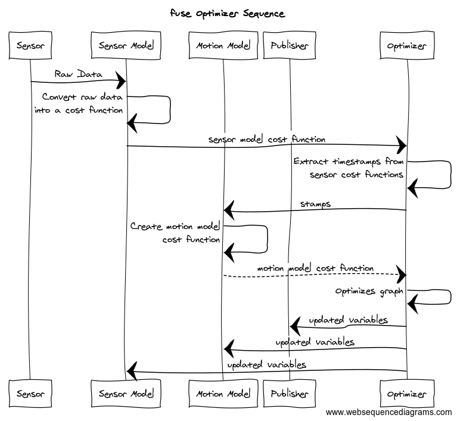
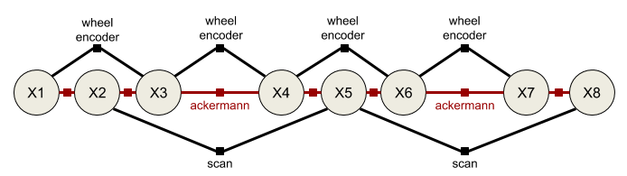
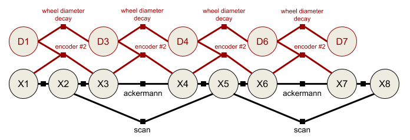

# fuse

**NOTE**: The `rolling` branch is a [work in progress](https://github.com/locusrobotics/fuse/issues/276) port of the fuse stack to ROS 2, it is **not** expected to work until said work is done!

The fuse stack provides a general architecture for performing sensor fusion live on a robot. Some possible applications
include state estimation, localization, mapping, and calibration.

## Overview

fuse is a ROS framework for performing sensor fusion using nonlinear least squares optimization techniques. In
particular, fuse provides:

* a plugin-based system for modeling sensor measurements
* a similar plugin-based system for motion models
* a plugin-based system for publishing optimized state values
* an extensible state variable definition
* a "contract" on how an optimizer will interact with the above components
* and some common implementations to get everyone started

(unpresented) ROSCon 2018 Lightning Talk [slides](doc/fuse_lightning_talk.pdf)

Data flows through the system approximately like this:

* A sensor model receives raw sensor data. The sensor model generates a constraint and sends it to the optimizer.
* The optimizer receives the new sensor constraint. A request is sent to each configured motion model to generate
  a constraint between the previous state and the new state involved in the sensor constraint.
* The motion model receives the request and generates the required constraints to connect the new state to the
  previously generated motion model chain. The motion model constraints are sent to the optimizer.
* The optimizer adds the new sensor model and motion model constraints and variables to the graph and
  computes the optimal values for each state variable.
* The optimal state values are sent to each configured publisher (as well as the sensor models and motion models).
* The publishers receive the optimized state values and publish any derived quantities on ROS topics.
* Repeat

It is important to note that much of this flow happens asynchronously in practice. Sensors are expected to operate
independently from each other, so each sensor will be sending constraints to the optimizer at its own frequency. The
optimizer will cache the constraints and process them in small batches on some schedule. The publishers may
require considerable processing time, introducing a delay between the completion of the optimization cycle and the
publishing of data to the ROS topic.

## Example

Let's consider a simple robotics example to illustrate this. Assume we have a typical indoor differential-drive robot.
This robot has wheel encoders and a horizontal laser.

The first thing we must do is define our state variables. At a minimum, we want the robot pose at each timestamp.
We model the pose using a 2D position and an orientation. Each 2D pose _at a specific time_ gets a unique variable
name. For ease of notation, let's call the pose variables `X1`, `X2`, `X3`, etc. (In reality, each variable gets
a UUID, but those are much harder to write down.) Each 2D pose is instantiated as a `example_robot::Pose2D` which is
derived from the `fuse_core::Variable` base class. (`fuse` ships with several basic variables, such as 2D and 3D
versions of position, orientation, and velocity variables, but you can derive your own variable types as you need them.)

Next we need to decide how to model our sensors. We can model the wheel encoders as providing an incremental
pose measurement. Given a starting pose, `X1`, and a wheel encoder delta, `z`, we predict the pose `X2'` using some
measurement function `f`.

`X2' = f(X1, z)`

The error term for our constraint is the difference between the predicted pose `X2'` and the actual pose `X2`

`error = X2'^-1 * X2`

where `X2'^-1` is the inverse of the pose `X2'`

We derive a `fuse_core::Constraint` that implements that error function. Similarly, we perform scan-to-scan matching
using out laser data and create an incremental pose constraint between consecutive scans.

In the simplest example, the sensors are synchronized, i.e. the laser and the wheel encoders are sampled at the same
time. This is enough to construct our first `fuse` system. Below is the constraint graph generated from this first
system. The large circles represent state variables at a given time, while the small squares represent measurements.
The graph connectivity indicates which variables are involved in what measurements.

The two sensor models are configured as plugins to an optimizer implementation. The optimizer performs the required
computation to generate the optimal state variable values based on the provided sensor constraints. We will never be
able to exactly satisfy both the wheel encoder constraints and the laserscan constraints. Instead we minimize the error
of all the constraints using nonlinear least squares optimization.

While our `fuse` system is optimizing constraints from two different sensors, it is not yet publishing any data back
out to ROS. In order to publish data to ROS, we derive a `fuse_core::Publisher` class and add it to the
optimizer. Derived publishers have access to the optimized values of all state variables. The specific publisher
implementation determines what type of messages are published and at what frequency. For our example system,
we would like visualize the current pose of the robot in RViz, so we create a `fuse` publisher that finds the most
recent pose and converts it into a `geometry_msgs::msg::PoseStamped` message, then publishes the message to a topic.

We finally have something that is starting to be useful.

### Adaptation #1: Asynchronous sensors

Typically the laser measurements and the wheel encoder measurements are not synchronized. The encoder measurements are
sampled faster than the laser, and are sampled at different times using a different clock. If we do not do anything
different in this situation, the constraint graph becomes disconnected.

This is where motion models come into play. A motion model differs from a sensor model in that constraints can be
generated between any two requested timestamps. Motion model constraints are generated upon request, not due to their
own internal clock. We use the motion model to connect the states introduced by the other sensor measurements. We
derive a class from the `fuse_core::MotionModel` base class and implement a differential drive kinematic
constraint for our robot.

The motion models are also configured as plugins to the optimizer. The optimizer requests motion models constraints
from the configured plugins whenever new states are created by the sensor models.

### Adaptation #2: Full path publishing

Nothing about the `fuse` framework limits you to having a single publisher. What if you want to visualize the entire
robot trajectory, instead of just the most recent pose? Well, we can create a new derived `fuse_core::Publisher` class
that publishes all of the robot poses using a `nav_msgs::msg::Path` message.

### Adaptation #3: Changing kinematics

In your spare time, you also build [autonomous power wheels racers](http://www.powerracingseries.org/). But race cars
don't use differential drive; you need a different motion model. Easy enough. We simply derive a new
`fuse_core::MotionModel` class that implements an Ackermann steering model. Everything else can be reused.

### Adaptation #4: Online calibration

Over time you notice that the accuracy of the odometry measurements is decreasing. After some investigation you realize
that the soft rubber racing tires are wearing, decreasing the diameter of the wheels over time. It sure would be nice
if the odometry system could compensate for that automatically. To do that, we derive a new variable type from
`fuse_core::Variable` that holds a single scalar value representing a wheel diameter at a specific point in time. For
ease of notation, we refer to this new variable as `D1, D2, ...`, etc. We also need to derive a new wheel encoder sensor
model from the `fuse_core::SensorModel` base class. This new sensor model involves the previous pose and next pose as
before, but it also involves the previous wheel diameter. Finally, we need a `fuse_core::MotionModel` that describes
how the wheel diameter is expected to change over time. Maybe some sort of exponential decay? And for good measure, we
derive a new publisher plugin from `fuse_core::Publisher` that publishes the current wheel diameter. This allows us to
plot how the wheel diameter changes over the length of the race.

Now our system estimates the wheel diameters at each time step as well as the robot's pose.

## The Math

Internally `fuse` uses Google's [Ceres Solver](http://ceres-solver.org) to perform the nonlinear least squares
optimization, which produces the optimal state variable values. I direct any interested parties to the Ceres Solver
["Non-linear Least Squares"](http://ceres-solver.org/nnls_tutorial.html) tutorial for an excellent primer on the core
concepts and involved math.

## Summary

The purpose of `fuse` is to provide a framework for performing sensor fusion tasks, allowing common components to be
reused between systems, while also allowing components to be customized for different use cases. The goal is to allow
end users to concentrate on modeling the robot, sensor, system, etc. and spend less time wiring the different
sensor models together into runable code. And since all of the models are implemented as plugins, separate plugin
libraries can be shared or kept private at the discretion of their authors.

## API Concepts

* [Variables](doc/Variables.md)
* [Constraints](doc/Constraints.md)
* Sensor Models -- coming soon
* Motion Models -- coming soon
* Publishers -- coming soon
* Optimizers -- coming soon
