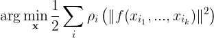
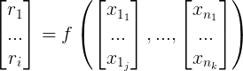
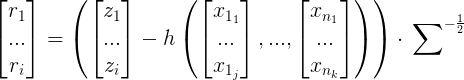
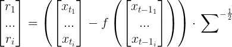
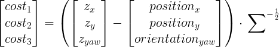

# Constraints

The concept of a Constraint has many names: constraints, cost functions, factors, probably many others. At the most
basic level, a Constraint accepts one or more Variable values and produces a score. The Optimizer will then search
for the values of all the Variables that minimizes the total score. This search is performed by a nonlinear
least-squares solver. The fuse stack employs [Google's Ceres Solver](http://ceres-solver.org/) as that least-squares
solver. As a consequence, the fuse_core::Constraint plugin classes are basically just vehicles for creating the
required Ceres Solver objects.

## Constraint Modeling

Ceres Solver provides an excellent [tutorial](http://ceres-solver.org/nnls_modeling.html#introduction) on system
modeling for least-squares optimization. The following are some important highlights, but reading the Ceres Solver
documentation is highly recommended.

The nonlinear least-squares system used by the Ceres Solver is written as:



In Ceres Solver parlance, &rho;() is called a "loss function". f() is called a "cost function", which accepts one or
more inputs, x. And the inputs, x, are called "parameter blocks". The "parameter blocks" themselves may be
single-dimensional or multi-dimensional vectors. The least-squares system consists of many &rho;(f()<sup>2</sup>)
terms, and the solver's job is to find the specific values of all the inputs that minimize the sum of the squared
costs.

In fuse, a Constraint class models one of the &rho;(f()<sup>2</sup>) terms.

### Parameter Blocks

The concept of the "parameter block" is modeled by the [Variable](Variables.md) classes in fuse. The Constraint merely
needs to define which specific Variable identities are to be used as the input to modeled cost function. This is done
by accepting, at a minimum, the UUID of each involved Variable.

The derived Constraints provided by the [fuse_constraints](../fuse_constraints) package go one step further, and
require instances of full Variable types rather than just the Variable's UUID. This is done solely to enforce
type-safety; e.g. a specific Constraint must involve two
[Position2DStamped](../fuse_variables/include/fuse_variables/position_2d_stamped.h) variables, no other variable types
are acceptable.

### Cost Function

The "cost function" is the main component of the Constraint object. It is responsible for computing the cost to be
minimized by the Ceres Solver optimizer. The cost function must implement some sort of equation to generate a score
for arbitrary input values. In its most generic form, that equation is written simply as:



where f() is the cost function, x<sub>1</sub> through x<sub>n</sub> are the input Variables, each of which may contain
multi-dimensional data, and r<sub>i</sub> are one or more dimensions of the computed costs. In Ceres Solver notation,
the r<sub>i</sub> terms are called "residuals".

This places very few limits on the form these equations take. They must accept one or more inputs, and must produce
one or more outputs. However, in practice there are two common forms for cost functions.

#### Observation Model

An observation model, sometimes called a sensor model, predicts a sensor measurement based on the current estimates
of the system Variables. The cost is then computed as the difference between the predicted sensor measurement and the
actual sensor measurement, normalized by the measurement uncertainty.



where z is the sensor measured, h() is the sensor prediction function, and &Sigma; is the covariance matrix. Within
the least-squares minimization, the entire cost function will get squared. By dividing by the square root of the
covariance, we effectively divide the squared error by the full covariance in the least-squares formulation.
The inverse of the covariance matrix is called the "information matrix", and thus we are normalizing by the square
root information matrix here.

#### State Transition Model

A state transition model, sometimes called a motion model, predicts the value of a future Variable based on the
current estimates of the system Variables. This is generally used to enforce a physical model of the system, such
as known vehicle kinematics.



where x<sub>t</sub> is the current Variable estimate for time _t_, x<sub>t-1</sub> is the current Variable estimate
for time _t-1_, f() is the state prediction function that implements the desired kinematic or dynamic model
(apologies for using f() in two places, but f() is the standard naming for the state transition model in Kalman filter
literature), and &Sigma; is some estimate of the model prediction uncertainty. Again, we normalize by the square root
of the covariance matrix so that the least-squares formulation is normalized by the full covariance matrix.

### Loss Function

The "loss function" is an optional function that may be applied to the computed squared cost before optimization. In
practice, loss functions are used to reduce the impact of incorrect or outlier constraints that are included in the
least-squares problem. By default, the loss function is the identity function, which means that deviations from the
ideal input values for that cost function will have a quadratic effect on the optimization. If erroneous constraints
may be added to the system, this quadratic effect can lead to poor optimized results. Various loss functions are
provided by Ceres Solver that reduce the impact of cost functions with very high costs. The Huber Loss Function is a
common choice, which applies a quadratic effect for small costs, and a linear effect for large costs. And of coarse,
you can implement your own loss functions if the desired function is not available from Ceres Solver itself.


<center>Example Loss Functions available in Ceres Solver</center>

For additional information, see the [Loss Function](http://ceres-solver.org/nnls_modeling.html#lossfunction) section
of the Ceres Solver documentation.

## Constraint API

Like basically everything in fuse, the Constraint system is designed to be extensible. The
[`fuse_core::Constraint`](../fuse_core/include/fuse_core/constraint.hpp) base class defines the minimum interface
required for all derived Constraints.

* `Constraint::uuid() -> fuse_core::UUID`

  Each derived class is required to return a unique ID to act as the identity of the Constraint. Unlike the Variables,
  each generated derived Constraint object is unique. It is completely valid to produce two Constraints of the same
  type that involve the same Variables. Consequently, a random UUID is generated for each constructed Constraint. This
  is performed by the base class; derived classes do not need to implement this function..

* `Constraint::variables() -> vector<fuse_core::UUID>`

  Each derived class is required to provide read-only access to the ordered collection of Variable UUIDs involved with
  the derived Constraint. The base class holds the collection, and provides the read-only accessor. Derived classes
  are expected to provide the collection of Variable UUIDs to base class during construction.

* `Derived::type() -> std::string`

  All derived Constraints must implement a `type()` method that returns the fully-qualified class name. This is of the
  form `namespace::ClassName`. Under most circumstances, the base class implementation will return the correct class
  name. However, templated Constraints may need to override the `type()` method to return the desired name.

* `Derived::print(std::ostream& stream)`

  It's nice to be able to print important information during debugging. Each derived Constraint is required to
  implement a `print()` method, but the details of exactly what to print are left to the derived Constraint class
  designer. At a minimum, the Constraint `type()`, `uuid()`, and involved variables are suggested.

* `Derived::clone() -> fuse_core::Constraint::UniquePtr`

  All derived Constraints are required to implement a `clone()` method. This should be implemented as
  `return Derived::make_unique(*this)`. Because this definition requires the use of the derived type, a common
  implementation could not be provided in the base class.

* `Derived::costFunction() -> ceres::CostFunction*`

  All derived classes must implement the `costFunction()` method, and return a valid Ceres Solver `CostFunction`
  pointer. Ceres Solver will take ownership of the loss function pointer and delete it when appropriate. There are
  a few `CostFunction` objects available within the Ceres Solver code base, and several additional ones available in
  the [fuse_constraints](../fuse_constraints) package. However, it is expected that most derived classes will need to
  implement their `ceres::CostFunction` as well. This is how the author of the derived class is able to model the
  specific behavior of a sensor or vehicle. See the
  [Ceres documentation](http://ceres-solver.org/nnls_modeling.html#costfunction) for details on implementing a
  `ceres::CostFunction`. Additionally, see the [documentation](http://ceres-solver.org/derivatives.html) about
  implementing derivatives within Ceres Solver. Ceres Solver supports a powerful automatic derivative system, in
  addition to numerical and analytic derivatives. This is one of the features that drove the selection of Ceres
  Solver as the optimization engine in fuse.

* `Derived::lossFunction() -> ceres::LossFunction*`

  By default, the `lossFunction()` method will return a `nullptr`, which indicates that a "unity" loss function should
  be used. Optionally, derived classes may override the `lossFunction()` method to return a pointer to the loss
  function of their choice. Ceres Solver will take ownership of the loss function pointer and delete it when
  appropriate.

* `SMART_PTR_DEFINITIONS(Derived);`

  It is highly recommended that all derived Constraints include `SMART_PTR_DEFINITIONS(Derived);` in the public
  interface. This defines some common smart pointer aliases, such as `Derived::SharedPtr` and `Derived::UniquePtr`.

## Example

As a concrete example, we will review the details of `AbsolutePose2DStampedConstraint` class provided in the
[`fuse_constraints`](../fuse_constraints) package. For illustrative purposes, some of the more advanced options of
this constraint have been omitted in the code sample below.

```C++
class AbsolutePose2DCostFunctor
{
private:
  fuse_core::Matrix3d A_;
  fuse_core::Vector3d b_;

public:
  AbsolutePose2DCostFunctor(const fuse_core::Matrix3d& A, const fuse_core::Vector3d& b) :
    A_(A),
    b_(b)
  {}

  template <typename T>
  bool operator()(const T* const position, const T* const orientation, T* residual) const
  {
    Eigen::Map<Eigen::Matrix<T, 3, 1>> residuals_map(residual);
    residuals_map(0) = position[0] - T(b_(0));
    residuals_map(1) = position[1] - T(b_(1));
    residuals_map(2) = orientation[0] - T(b_(2));
    wrapAngle2D(residuals_map(2));
    residuals_map.applyOnTheLeft(A_.template cast<T>());
    return true;
  }
};

class AbsolutePose2DStampedConstraint : public fuse_core::Constraint
{
private:
  fuse_core::Vector3d mean_;
  fuse_core::Matrix3d sqrt_information_;

public:
  SMART_PTR_DEFINITIONS(AbsolutePose2DStampedConstraint);

  AbsolutePose2DStampedConstraint(
    const fuse_variables::Position2DStamped& position,
    const fuse_variables::Orientation2DStamped& orientation,
    const fuse_core::Vector3d& mean,
    const fuse_core::Matrix3d& covariance) :
      fuse_core::Constraint{position.uuid(), orientation.uuid()},
      mean_(mean),
      sqrt_information_(covariance.inverse().llt().matrixU())
  {}

  void print(std::ostream& stream = std::cout) const override
  {
    stream << type() << "\n"
          << "  uuid: " << uuid() << "\n"
          << "  position variable: " << variables_.at(0) << "\n"
          << "  orientation variable: " << variables_.at(1) << "\n"
          << "  mean: " << mean_.transpose() << "\n"
          << "  sqrt_info: " << sqrtInformation() << "\n";
  }

  fuse_core::Constraint::UniquePtr clone() const override
  {
    return AbsolutePose2DStampedConstraint::make_unique(*this);
  }

  ceres::CostFunction* costFunction() const override
  {
    return new ceres::AutoDiffCostFunction<AbsolutePose2DCostFunctor, 3, 2, 1>(
      new AbsolutePose2DCostFunctor(sqrt_information_, mean_));
  }

  const fuse_core::Vector3d& mean() const { return mean_; }
  const fuse_core::MatrixXd& sqrtInformation() const { return sqrt_information_; }
};
```

Now let's examine the class details step by step.

First, we need a `ceres::CostFunction` object that implements our desired model. A 2D pose prior models sensors that
measure the full robot pose in a global coordinate frame. Things like GPS or scan matching to a prior map could be
modeled this way. Our cost function will follow the "observation model", where the input variables will be used to
predict the sensor measurement, and the cost will be the different between the measured and the prediction normalized
by the measurement uncertainty.



We will make use of Ceres Solver's automatic derivative system to compute the Jacobians. For that to work, we must
implement the cost function equation as a functor object (has an `operator()` method). To compute the cost, our
functor will need access to the measurement vector (3x1 vector) and the measurement uncertainty. Holding the
uncertainty as a square root information matrix (3x3 upper triangular matrix) is convenient for implementing the
above cost equation. By convention, the measurement vector is named `b` and the square root information matrix is
named `A`.

```C++
class AbsolutePose2DCostFunctor
{
private:
  fuse_core::Matrix3d A_;
  fuse_core::Vector3d b_;

public:
  AbsolutePose2DCostFunctor(const fuse_core::Matrix3d& A, const fuse_core::Vector3d& b) :
    A_(A),
    b_(b)
  {}
```

Additionally, the functor's `operator()` method must be a template function, capable of accepting as least `double`
and `ceres::Jet` objects as input. Since fuse uses separate Variables to hold the position and orientation data,
our functor must accept two input "parameter blocks". It must also accept a mutable vector used to store the output
costs/residuals.

```C++
class AbsolutePose2DCostFunctor
{
public:
  template <typename T>
  bool operator()(const T* const position, const T* const orientation, T* residual) const;
}
```

And in the body of the `operator()` method, we need to compute the residuals according to our desired cost equation.
```C++
template <typename T>
bool operator()(const T* const position, const T* const orientation, T* residual) const
{
  Eigen::Map<Eigen::Matrix<T, 3, 1>> residuals_map(residual);
  residuals_map(0) = position[0] - T(b_(0));
  residuals_map(1) = position[1] - T(b_(1));
  residuals_map(2) = orientation[0] - T(b_(2));
  wrapAngle2D(residuals_map(2));
  residuals_map.applyOnTheLeft(A_.template cast<T>());
  return true;
}
```

The `residual_map` variable allows us to treat the simple C-style array of residuals as an `Eigen` matrix object:
```C++
Eigen::Map<Eigen::Matrix<T, 3, 1>> residuals_map(residual);
```

such that we can perform matrix multiplications efficiently:
```C++
residuals_map.applyOnTheLeft(A_.template cast<T>());
```

The only other thing of note is the special treatment of the orientation.
```C++
wrapAngle2D(residuals_map(2));
```
This ensures the orientation error is always minimum phase, treating &pi;/2 and 5&pi;/2 as the same error.

Now that we have our Ceres Solver compatible cost functor implemented, we can create the fuse constraint. All new
Constraints must derive from the fuse_core::Constraint base class.

```C++
class AbsolutePose2DStampedConstraint : public fuse_core::Constraint
```

In the derived class constructor, we specify the required input Variable types to enforce type-safety during
Constraint creation. We then just pass the input Variables UUIDs to the base class constructor. Additionally,
we pass in the measurement vector and measurement covariance, so that we can generate cost functor instances later.

```C++
private:
  fuse_core::Vector3d mean_;
  fuse_core::Matrix3d sqrt_information_;

public:
  AbsolutePose2DStampedConstraint(
    const fuse_variables::Position2DStamped& position,
    const fuse_variables::Orientation2DStamped& orientation,
    const fuse_core::Vector3d& mean,
    const fuse_core::Matrix3d& covariance) :
      fuse_core::Constraint{position.uuid(), orientation.uuid()},
      mean_(mean),
      sqrt_information_(covariance.inverse().llt().matrixU())
  {}
```

A little bit of linear algebra converts the covariance matrix into the square root information matrix needed by the
cost functor.

```C++
sqrt_information_(covariance.inverse().llt().matrixU())
```

The derived Constraint `uuid()` and `type()` methods are inherited from the base class and do not need to be
overridden. But we do need to provide a `print()` method. Here we print the Constraint type, UUID, and involved
Variable UUIDs. The details of what to print are left entirely up to the derived class's author.

```C++
public:
  void print(std::ostream& stream = std::cout) const override
  {
    stream << type() << "\n"
          << "  uuid: " << uuid() << "\n"
          << "  position variable: " << variables_.at(0) << "\n"
          << "  orientation variable: " << variables_.at(1) << "\n";
  }
```

We must also provide a `clone()` method. Here we used the recommended implementation.

```C++
public:
  fuse_core::Constraint::UniquePtr clone() const override
  {
    return AbsolutePose2DStampedConstraint::make_unique(*this);
  }
```

And finally, the required `costFunction()` implementation. We use a combination of the `ceres::AutoDiffCostFunction`
class and our custom cost functor to create the output `ceres::CostFunction` pointer. The full details of the
`ceres::AutoDiffCostFunction` are available [here](http://ceres-solver.org/nnls_modeling.html#autodiffcostfunction).
But briefly, the `ceres::AutoDiffCostFunction` template parameters are:

* the functor class used to compute the cost
* the number of produced residuals
* the number of dimensions of the first Variable
* the number of dimensions of the second Variable

We use our cost functor, `AbsolutePose2DCostFunctor`. The cost functor produces three residuals,
one for each dimension of the 2D pose. The first input Variable is a `Position2DStamped`, which has two dimensions,
`x` and `y`. And the second Variable is an `Orientation2dStamped`, which has only one dimension, `yaw`.

```C++
public:
  ceres::CostFunction* costFunction() const override
  {
    return new ceres::AutoDiffCostFunction<AbsolutePose2DCostFunctor, 3, 2, 1>(
      new AbsolutePose2DCostFunctor(sqrt_information_, mean_);
  }
```

We don't want to use a custom loss function, so we use the base class implementation of the required `lossFunction()`
method.

And finally we reach the recommended but optional implementation details.

```C++
public:
  SMART_PTR_DEFINITIONS(AbsolutePose2DStampedConstraint);
```

Calling the `SMART_PTR_DEFINITIONS` macro inside the `public` region of the derived Variable is not strictly required,
but it is very strongly recommended. This creates some standard aliases for variable smart pointer types, e.g.
`AbsolutePose2DStampedConstraint::SharedPtr` and `AbsolutePose2DStampedConstraint::UniquePtr` as well as a some smart
pointer creation functions, e.g.`AbsolutePose2DStampedConstraint::make_shared()` and
`AbsolutePose2DStampedConstraint::make_unique()`.

```C++
public:
  const fuse_core::Vector3d& mean() const { return mean_; }
  const fuse_core::MatrixXd& sqrtInformation() const { return sqrt_information_; }
```

Providing accessor functions for the additional constructor arguments is also recommended.
