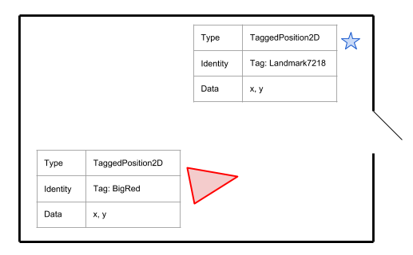
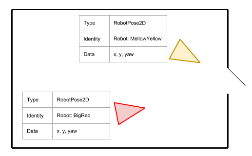
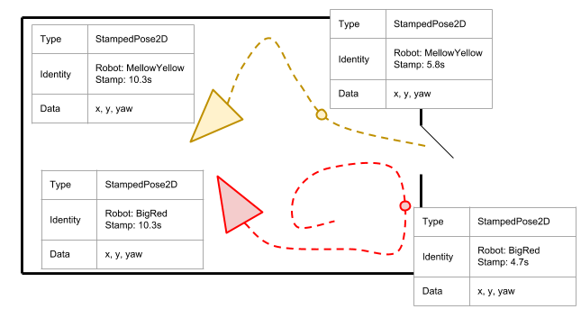

# Variables

In the fuse stack, a Variable does two things:

## Variable Value

First, a Variable has a _value_. A Variable holds one or more dimensions of floating point data that represents some
physical or logical property. For example, a two dimensional pose consists of `x`, `y`, and `yaw` floating point
values. A single Variable class could be implemented to hold all three pose dimensions. The exact value of each
dimension will be unknown and uncertain. It is the job of an Optimizer to find the most likely value of each dimension
held by each Variable instance in the system.

## Variable Identity

Second, a Variable must have an _identity_, some way of distinguishing one occurrence of a Variable from another within
the system. There are several reasons multiple identities of a Variable will be contained within a single system:

* The Variable may represent a property common to multiple entity types. Both a robot and a visual landmark have a
  position in space. Different identities of the same Variable may be used to describe these different entities.
  
* Similarly, there may be multiple occurrences of the same entity type within the system. A multi-robot configuration
  will want to track the pose of each robot, and thus different identities of a Variable will be used for each robot
  in the system.
  
* Most commonly, a Variable will represent a time-varying process. A different identity will be required for each
  time instant for which the process value is to be estimated. For example, the pose of the robot will change over
  time, so we need a unique identity representing the robot pose at time `t1` **and** another unique identity
  representing the robot pose at time `t2`. Any time-varying process must be discretized within the fuse stack.
  

The identity takes the form of a UUID or hash, and is generally derived from a set of additional properties that
describe what makes each occurrence unique from other occurrences. In the case of a time-varying process, this will
likely involve the timestamp. In the case of a Variable that can describe multiple robots, this might involve the
serial number of the robot.

An important aspect of the identity is that the same UUID must be generated when the same identity is referenced
from different places in the distributed fuse stack. For example, a robot may estimate its pose at a specific time
using wheel odometry measurements, and it may estimate its pose at the same time instant using some laserscan
matching algorithm. Both measurements involve the same identity: the pose of robot `R` measured at time `t`, and
thus both sensors must generate a Variable instance with the same identity.

## Design Principles

The most important consideration when creating a new Variable is deciding what data dimensions should be
included. Including too many physical properties in a Variable will be inefficient and cumbersome when used in
places where most of the dimensions are unused. However, including too few physical properties in a Variable
also leads to inefficient and cumbersome usage when even the simplest of observation models involve many variables.
This is one of those "Goldilocks principle" situations.


Understanding how Variable interact with the rest of the system will help in the design of "good" Variable.

* The fuse stack is designed to combine observations _of the same variable identity_ from multiple sources. As
  described above, if a robot measures its current pose using wheel odometry as well as with a laserscan, then we have
  two different measurements of the same pose. In order for these two measurements to be combined together in fuse,
  **they must use the same Variable class**. In a way, the Variables are analogous to message definitions in ROS.
  Much of the power of ROS comes from the use of common message types across the ROS ecosystem. While it is possible
  for someone to define a custom laserscan message that matches their use-case exactly, no other existing code would
  be compatible with that custom laserscan message. You would be unable to use the laser filters package, or visualize
  the laser data in RViz. Whenever possible, it is preferred to reused existing messages, even if they are not a
  perfect fit. Similarly, because the fuse Variable class must match exactly to be combined together, it is always
  better to reuse existing Variables.
* A measurement can involve multiple Variable instances and multiple Variable classes. For example, a measurement could
  involve both a 2D pose **and** a 2D velocity. This allows a system with a large number of measured dimensions to be
  broken up into smaller, more reusable Variables. It may be tempting to break down the state in single-dimension
  quantities; e.g. `x` is one Variable, `y` is a second Variable, etc. This would allow the most possible
  Variable reuse, after all. However, it also means that certain kinds of measurements will involve an annoyingly
  large number of inputs. For example, a 3D inertial strapdown sensor estimates the change in the 3D pose,
  3D velocity, and 3D linear acceleration. This involves a total of 15 dimensions of data measured at two different
  timestamps. If every dimension is its Variable, such a measurement would require 30 inputs, making
  it very awkward to write.
* Conversely, a Variable could be defined that contains all the measured dimensions of your system. In the 3D inertial
  strapdown case, this would a 15-dimensional vector representing the 3D pose, 3D velocity, and 3D linear acceleration
  at a specific timestamp. However, this means that every sensor must consume all 15 dimensions and define the error
  function in terms of all 15 dimensions, even if the sensor only measures a small subset of those dimensions. At best,
  this is inconvenient. It will also limit your ability to reuse sensor models from external sources, unless the
  external source happened to use that exact same 15-dimensional Variable.
* For the purposes of efficient sparse matrix operations, all of the dimensions of a variable are treated as a group.
  If there are too many dimensions in a Variable, resulting in measurements errors with large numbers of zeros,
  then that sparsity information is lost. This can lead to performing dense matrix operations on larger-than-needed
  blocks, and to suboptimal solving orders. If there are too few dimensions in a Variable, then computation will
  be wasted computing the solving order over each dimension instead of each block.

For the most part, reasonable Variables will be fairly obvious: 2D position, 2D velocity, 2D acceleration, etc.
The biggest debate is generally whether to include the linear and angular information into a single Variable (e.g.
a 2D pose consists of a 2D position and 2D orientation), or the if they should be separate. For fuse, it was decided
to keep the linear and angular components separate. The [`fuse_variables`](../fuse_variables) package provides a set
of common, reusable 2D and 3D Variables. And submissions of new Variables are always welcome.

## Variable API

Like basically everything in fuse, the Variable system is designed to be extensible. The
[`fuse_core::Variable`](../fuse_core/include/fuse_core/variable.h) base class defines the minimum interface required
for all derived Variables.

* `Derived::type() -> std::string`

  All derived Variables must implement a `type()` method that returns the fully-qualified class name. This is of the
  form `namespace::ClassName`. Under most circumstances, the base class implementation will return the correct class
  name. However, templated Variables may need to override the `type()` method to return the desired name.

* `Derived::size() -> size_t`

  The derived Variable must return the number of dimensions of its value. This will likely just return a fixed
  constant.

* `Derived::data() -> double*`

  The value portion of the derived Variable must be accessible from a contiguous memory location of size
  `derived.size() * sizeof(double)`.

* `Derived::uuid() -> fuse_core::UUID`

  Each derived class is required to return a unique ID to act as the identity of the Variable. Some functions for
  generating UUIDs are provided [here](../fuse_core/include/fuse_core/uuid.h).

* `Derived::print(std::ostream& stream)`

  It's nice to be able to print important information during debugging. Each derived Variable is required to
  implement a `print()` method, but the details of exactly what to print are left to the derived Variable class
  designer. At a minimum, the Variable `type()` and `uuid()` is suggested.

* `Derived::clone() -> fuse_core::Variable::UniquePtr`

  All derived Variables are required to implement a `clone()` method. This should be implemented as
  `return Derived::make_unique(*this)`. Because this definition requires the use of the derived type, a common
  implementation could not be provided in the base class.

* `Derived::localParameterization() -> ceres::LocalParameterization*`

  This is a complex topic on its own. See the
  [Ceres documentation](http://ceres-solver.org/nnls_modeling.html#localparameterization) for an in-depth discussion
  of "local parameterizations" and their uses. If the derived Variable requires a local parameterization, this
  method may be overridden to provide it.

* `SMART_PTR_DEFINITIONS(Derived);`

  It is highly recommended that all derived Variables include `SMART_PTR_DEFINITIONS(Derived);` in the public
  interface. This defines some common smart pointer aliases, such as `Derived::SharedPtr` and `Derived::UniquePtr`.

Additional member properties and member functions may be added to the derived Variable. These can only be used
when an object is created with a known type. Despite this limitation, providing some syntax sugar is encouraged, as
it can make working with the derived Variable objects more satisfying. For example, `fuse_variables` classes provide
named accessors for the individual dimension values. This allows use of `var.y()` in lieu of `var.data()[1]`.

## Example

As a concrete example, we will review the details of `Position2dStamped` Variable class provided in the
[`fuse_variables`](../fuse_variables) package. For illustrative purposes, some class hierarchies present in the actual
code have been collapsed in the code sample below.

```C++
class Position2DStamped : public fuse_core::Variable
{
private:
  std::array<double, 2> data_;
  fuse_core::UUID device_id_;
  rclcpp::Time stamp_;
  fuse_core::UUID uuid_;

public:
  SMART_PTR_DEFINITIONS(Position2DStamped);

  Position2DStamped(const rclcpp::Time& stamp, const fuse_core::UUID& device_id) :
    data{},
    device_id_(device_id),
    stamp_(stamp),
    uuid_(fuse_core::uuid::generate(type(), stamp, device_id))
  {}

  size_t size() const override { return data_.size(); }

  const double* data() const override { return data_.data(); }
  double* data() override { return data_.data(); }

  fuse_core::UUID uuid() const override { return uuid_; }

  void print(std::ostream& stream = std::cout) const override
  {
    stream << type() << ":\n"
           << "  uuid: " << uuid() << "\n"
           << "  stamp: " << stamp() << "\n"
           << "  device_id: " << deviceId() << "\n"
           << "  size: " << size() << "\n"
           << "  data:\n"
           << "  - x: " << data_[0] << "\n"
           << "  - y: " << data_[1] << "\n";
  }

  fuse_core::Variable::UniquePtr clone() const override
  {
    return Position2DStamped::make_unique(*this);
  }

  const rclcpp::Time& deviceId() const { return device_id_; }
  const rclcpp::Time& stamp() const { return stamp_; }

  double& x() { return data_[0]; }
  const double& x() const { return data_[0]; }
  double& y() { return data_[1]; }
  const double& y() const { return data_[1]; }
};
```

Now let's examine the class details step by step.

All new Variables must derive from the fuse_core::Variable base class.

```C++
class Position2DStamped : public fuse_core::Variable
```

We need to define to define a contiguous memory location to hold the Variable's value. This is a 2D position
variable, so there are two data dimensions: `x` and `y`. There are several obvious options: a simple C-style array
`double[2]`, a variable-sized `std::vector<double>` that we resize appropriately, or a C++-style fixed-size array
`std::array<double, 2>`. Here we choose the C++-style array so we look "modern".

```C++
private:
  std::array<double, 2> data_;
```

Our Variable also needs to hold the identity information. For this Variable we want to support both multi-robot
scenarios as well as time-varying processes, so we need some sort of "robot id" and a timestamp. Since this is a
ROS library, we will use a `rclcpp::Time` (which subclasses `rclcpp::Time`) to hold the timestamp.
And we will choose a `fuse_core::UUID` to act as a generic "robot id". fuse ships with several functions
for converting strings and other types into a UUID ([UUID functions](../fuse_core/include/fuse_core/uuid.h)),
so this choice should support most use-cases.

```C++
private:
  fuse_core::UUID device_id_;
  rclcpp::Time stamp_;
```

fuse expects the identity portion of the Variable to be distilled into a `fuse_core::UUID` value. We choose to make
the Variable identity immutable so that the UUID may be computed once on construction. This allows us to cache the
UUID as a class member variable.

```C++
private:
  fuse_core::UUID uuid_;
```

As a consequence, when we construct a Position2DStamped instance, we must specify the `stamp` and `device_id`. After
construction, these values cannot be changed.

```C++
public:
  Position2DStamped(const rclcpp::Time& stamp, const fuse_core::UUID& device_id) :
    data{},
    device_id_(device_id),
    stamp_(stamp),
    uuid_(fuse_core::uuid::generate(type(), stamp, device_id))
  {}
```

Specifically note the function call:

```C++
fuse_core::uuid::generate(type(), stamp, device_id)
```

Here we are constructing the identity UUID from the type name itself, the value of `stamp` and the value of
`device_id`. Every Position2DStamped constructed with the same `stamp` and `device_id` value will generate the same
identity UUID.

And now for some less interesting things:

```C++
size_t size() const override { return data_.size(); }
```

The `fuse_core::Variable` interface requires read-only access to the number of dimensions of this Variable. Here, the
container's `size()` method is used. We could have also just `return 2;`.

```C++
const double* data() const override { return data_.data(); }
double* data() override { return data_.data(); }
```

The `fuse_core::Variable` interface requires read-write access to the data array via a C-style pointer, an artifact of
using Google Ceres under the hood for optimization. Again, we can use the built-in methods of our data container to
implement this requirement. And we provide both read-only and read-write versions to support proper const-correctness
in the surrounding code.

```C++
fuse_core::UUID uuid() const override { return uuid_; }
```

The `fuse_core::Variable` interface requires read-only access to the identity UUID value. Since we computed the UUID
during construction, we can just return our cached copy.

```C++
void print(std::ostream& stream = std::cout) const override
{
  stream << type() << ":\n"
         << "  uuid: " << uuid_ << "\n"
         << "  stamp: " << stamp_ << "\n"
         << "  device_id: " << device_id_ << "\n"
         << "  size: " << data_.size() << "\n"
         << "  data:\n"
         << "  - x: " << data_[0] << "\n"
         << "  - y: " << data_[1] << "\n";
}
```

We are required to implement a `print()` function as well. Here we print all the relevant properties to the provided
stream. The base class implements the C++ stream operator in terms of the polymorphic `print()` function, so variables
can be streamed to `std::cout` as well.

```C++
fuse_core::Variable::UniquePtr clone() const override
{
  return Position2DStamped::make_unique(*this);
}
```

And finally a `clone()` method is required. Here we implement `clone()` exactly as suggested in the
`fuse_core::Variable` documentation.

There are two method implementations inherited from the `fuse_core::Variable` base class.

```C++
std::string type() const { return boost::core::demangle(typeid(*this).name()); }
```

The base class implementation is smart enough to return the correct `fuse_variables::Position2dStamped` type string
here, so we don't need to reimplement the `type()` method.

And our "position" type behaves linearly, so there is no need to use a "local parameterization" inside the optimizer.

```C++
virtual ceres::LocalParameterization* localParameterization() const
{
  return nullptr;
}
```

Local parameterizations allow updating the dimensions of a Variable in a nonlinear way, in case the Variable describes
some sort of nonlinear manifold. It also allows a Variable to represent a lower degree-of-freedom property to be
embedded in a higher dimensional space. The classic example is a 3D rotation; a change in one of the rotation
dimensions can affect the values of all three rotation dimensions (i.e. it has a nonlinear update), and its 3 dof are
represented as a 4-dof quaternion. See the
[Ceres documentation](http://ceres-solver.org/nnls_modeling.html#localparameterization) for more information.

And finally we reach the recommended but optional implementation details.

```C++
public:
  SMART_PTR_DEFINITIONS(Position2DStamped);
```

Calling the `SMART_PTR_DEFINITIONS` macro inside the `public` region of the derived Variable is not strictly required,
but it is very strongly recommended. This creates some standard aliases for variable smart pointer types, e.g.
`Position2dStamped::SharedPtr` and `Position2dStamped::UniquePtr` as well as a some smart pointer creation functions,
e.g.`Position2dStamped::make_shared()` and `Position2dStamped::make_unique()`.

```C++
const rclcpp::Time& deviceId() const { return device_id_; }
const rclcpp::Time& stamp() const { return stamp_; }
```

Providing accessor functions for the identity information, not just the identity UUID, is also recommended.

```C++
double& x() { return data_[0]; }
const double& x() const { return data_[0]; }
double& y() { return data_[1]; }
const double& y() const { return data_[1]; }
```

And providing named accessors to the different dimensions is some nice syntax sugar.
